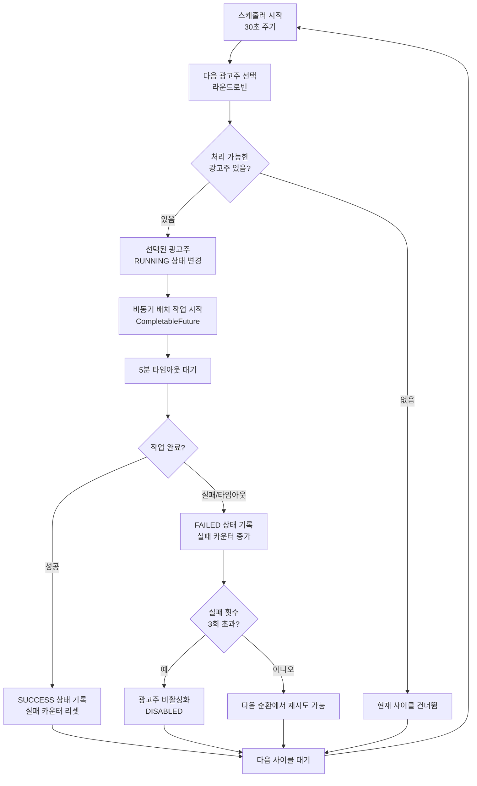

# 내결함성 라운드로빈 다중 광고주 CDP 배치 처리 시스템

## 📋 시스템 개요

이 시스템은 여러 광고주가 공유하는 CDP(Customer Data Platform) 데이터를 안전하고 효율적으로 처리하기 위한 내결함성 배치 처리 시스템입니다.

### 🎯 핵심 목표
- **공정한 자원 분배**: 모든 광고주가 동등하게 배치 처리 기회를 얻도록 보장
- **장애 격리**: 한 광고주의 실패가 다른 광고주에게 영향을 주지 않음
- **자동 복구**: 실패한 광고주의 자동 격리 및 복구 메커니즘
- **실시간 모니터링**: 시스템 상태를 실시간으로 추적 및 관리

## 🏗️ 시스템 아키텍처

```
┌─────────────────────────────────────────────────────────────────┐
│                    배치 작업 오케스트레이터                         │
│                  (BatchJobOrchestrator)                       │
│                                                               │
│  ┌─────────────────┐    ┌─────────────────┐    ┌──────────────┐ │
│  │   스케줄러       │    │   타임아웃       │    │   상태 추적   │ │
│  │  (30초 주기)    │    │  (5분 제한)     │    │  (성공/실패)  │ │
│  └─────────────────┘    └─────────────────┘    └──────────────┘ │
└─────────────────┬───────────────────────────────────────────────┘
                  │
                  ▼
┌─────────────────────────────────────────────────────────────────┐
│                  광고주 순환 서비스                                │
│               (AdvertiserRotationService)                      │
│                                                               │
│  ┌─────────────┐  ┌─────────────┐  ┌─────────────┐  ┌──────────┐ │
│  │ 라운드로빈   │  │  실패 추적   │  │  상태 관리   │  │ 격리 처리 │ │
│  │   선택       │  │   메커니즘   │  │   시스템     │  │  메커니즘  │ │
│  └─────────────┘  └─────────────┘  └─────────────┘  └──────────┘ │
└─────────────────┬───────────────────────────────────────────────┘
                  │
                  ▼
┌─────────────────────────────────────────────────────────────────┐
│                     광고주별 배치 작업                            │
│              (AdvertiserSpecific CDP Job)                      │
│                                                               │
│  ┌─────────────┐  ┌─────────────┐  ┌─────────────┐              │
│  │   Reader    │  │ Processor   │  │   Writer    │              │
│  │  (데이터 읽기) │  │ (AI 변환)   │  │ (결과 저장)  │              │
│  └─────────────┘  └─────────────┘  └─────────────┘              │
└─────────────────────────────────────────────────────────────────┘
```

## 🔄 라운드로빈 순환 메커니즘

### 기본 동작 원리

```
광고주 목록: [ADV001, ADV002, ADV003, ADV004, ADV005]
현재 인덱스: AtomicInteger currentIndex

사이클 1: currentIndex = 0 → ADV001 선택 → currentIndex = 1
사이클 2: currentIndex = 1 → ADV002 선택 → currentIndex = 2
사이클 3: currentIndex = 2 → ADV003 선택 → currentIndex = 3
사이클 4: currentIndex = 3 → ADV004 선택 → currentIndex = 4
사이클 5: currentIndex = 4 → ADV005 선택 → currentIndex = 0 (순환)
사이클 6: currentIndex = 0 → ADV001 선택 → ...
```

### 코드 구현 세부사항

```java
// 원자적 인덱스 업데이트 (스레드 안전)
int nextIndex = currentIndex.getAndUpdate(i -> (i + 1) % eligibleAdvertisers.size());

// 선택된 광고주 가져오기
Advertiser selectedAdvertiser = eligibleAdvertisers.get(nextIndex);

// 상태를 RUNNING으로 변경하여 중복 실행 방지
selectedAdvertiser.recordRunning();
```

## 🛡️ 장애 격리 및 내결함성

### 1. 광고주별 상태 관리

```
광고주 상태 전이도:

PENDING ──[배치 시작]──→ RUNNING ──[성공]──→ SUCCESS ──┐
   ▲                         │                      │
   │                         │                      │
   │                         ▼                      ▼
   └──[자동 복구]──── FAILED ◄──[실패]               PENDING
                        │
                        ▼
                   [3회 실패시]
                        │
                        ▼
                   DISABLED
```

### 2. 실패 격리 메커니즘

```
광고주 A 실패 시나리오:

시간 T0: [ADV001:RUNNING, ADV002:PENDING, ADV003:PENDING]
│
├─ ADV001 배치 작업 실패
│
├─ 즉시 상태 변경: ADV001 → FAILED (실패 카운트 +1)
│
└─ 다음 사이클에서 ADV001 제외, ADV002부터 계속 진행

결과: ADV002, ADV003는 영향받지 않고 정상 처리 계속
```

### 3. 타임아웃 보호

```java
// 5분 타임아웃 설정
CompletableFuture<Void> batchExecution = CompletableFuture.runAsync(() -> {
    executeBatchJob(advertiser);
});

try {
    batchExecution.get(5, TimeUnit.MINUTES);
} catch (TimeoutException e) {
    // 타임아웃 시 강제 종료 및 실패 처리
    batchExecution.cancel(true);
    rotationService.recordBatchFailure(advertiserId, e);
}
```

## 📊 시스템 운영 플로우

### 전체 처리 흐름



### 데이터베이스 상태 변화

```sql
-- 배치 처리 가능한 광고주 조회
SELECT * FROM advertisers 
WHERE batch_enabled = true 
  AND status = 'ACTIVE' 
  AND failure_count < max_failures 
  AND last_batch_status != 'RUNNING'
ORDER BY rotation_priority ASC, last_batch_run ASC NULLS FIRST;

-- 실행 상태로 변경
UPDATE advertisers 
SET last_batch_status = 'RUNNING' 
WHERE advertiser_id = 'ADV001';

-- 성공 시 상태 업데이트
UPDATE advertisers 
SET last_batch_status = 'SUCCESS',
    last_batch_run = NOW(),
    failure_count = 0,
    updated_at = NOW()
WHERE advertiser_id = 'ADV001';

-- 실패 시 상태 업데이트
UPDATE advertisers 
SET last_batch_status = 'FAILED',
    last_batch_run = NOW(),
    failure_count = failure_count + 1,
    batch_enabled = CASE 
        WHEN failure_count + 1 >= max_failures THEN false 
        ELSE batch_enabled 
    END,
    updated_at = NOW()
WHERE advertiser_id = 'ADV001';
```

## 🔧 엣지 케이스 처리

### 1. 모든 광고주 실패 시나리오

```
상황: 모든 광고주가 최대 실패 횟수에 도달

처리 방법:
1. findEligibleForBatch() → 빈 리스트 반환
2. 스케줄러는 현재 사이클을 건너뜀
3. 관리자가 수동으로 광고주를 복구할 때까지 대기
4. 복구 API: POST /api/admin/batch/reset/{advertiserId}
```

### 2. 동시성 충돌 시나리오

```
상황: 여러 스케줄러 스레드가 동시에 실행되는 경우

보호 메커니즘:
1. AtomicInteger로 인덱스 원자적 업데이트
2. DB 트랜잭션으로 상태 변경 일관성 보장
3. RUNNING 상태 체크로 중복 실행 방지
```

### 3. 시스템 재시작 시나리오

```
상황: 배치 작업 실행 중 시스템 재시작

복구 메커니즘:
1. 헬스 체크 스케줄러(5분 주기)가 스테일 작업 감지
2. 30분 이상 RUNNING 상태인 작업을 FAILED로 변경
3. 다음 순환에서 정상적으로 재처리
```

## 📈 모니터링 및 관리

### 시스템 상태 API

```bash
# 전체 시스템 상태 확인
curl http://localhost:8080/api/admin/batch/status
{
  "eligibleAdvertisers": 3,
  "runningJobs": 1,
  "statusTime": "2025-07-26T10:30:00"
}

# 처리 가능한 광고주 목록
curl http://localhost:8080/api/admin/batch/advertisers/eligible

# 현재 실행 중인 작업 목록
curl http://localhost:8080/api/admin/batch/advertisers/running

# 특정 광고주 수동 실행
curl -X POST http://localhost:8080/api/admin/batch/trigger/ADV001

# 실패한 광고주 복구
curl -X POST http://localhost:8080/api/admin/batch/reset/ADV001
```

### 로그 모니터링 키워드

```bash
# 정상 순환 확인
grep "라운드로빈으로 광고주.*선택됨" application.log

# 실패 상황 모니터링
grep "배치 작업 실패 기록" application.log
grep "최대 실패 횟수를 초과" application.log

# 타임아웃 상황 확인
grep "배치 작업 타임아웃" application.log

# 처리 가능한 광고주 없음
grep "배치 처리 가능한 광고주가 없습니다" application.log
```

## 🚀 성능 최적화

### 1. 메모리 캐싱
```java
// 실패 횟수를 메모리에 캐시하여 DB 조회 최소화
private final ConcurrentHashMap<String, Integer> advertiserFailureCount;
```

### 2. 배치 크기 조정
```yaml
# 광고주별 배치 청크 크기
chunk-size: 50  # 너무 크면 메모리 부족, 너무 작으면 성능 저하
```

### 3. DB 인덱스 최적화
```sql
-- 자주 사용되는 쿼리 최적화를 위한 인덱스
CREATE INDEX idx_advertisers_batch_eligible 
ON advertisers (batch_enabled, status, failure_count, last_batch_status);

CREATE INDEX idx_advertisers_rotation 
ON advertisers (rotation_priority, last_batch_run);
```

## 🔄 복구 시나리오

### 시나리오 1: 단일 광고주 복구

```bash
# 1. 광고주 상태 확인
curl http://localhost:8080/api/admin/batch/advertiser/ADV001

# 2. 실패 카운터 리셋
curl -X POST http://localhost:8080/api/admin/batch/reset/ADV001

# 3. 수동 배치 실행 테스트
curl -X POST http://localhost:8080/api/admin/batch/trigger/ADV001
```

### 시나리오 2: 전체 시스템 복구

```bash
# 1. 모든 실패한 광고주 조회
curl http://localhost:8080/api/admin/batch/advertisers/eligible

# 2. 각 광고주별 리셋 (스크립트 활용)
for adv in ADV001 ADV002 ADV003; do
  curl -X POST http://localhost:8080/api/admin/batch/reset/$adv
done

# 3. 시스템 상태 재확인
curl http://localhost:8080/api/admin/batch/status
```

이 시스템은 완전한 내결함성을 제공하며, 한 광고주의 문제가 전체 시스템에 영향을 주지 않도록 설계되었습니다. 실시간 모니터링과 자동 복구 기능으로 안정적인 운영이 가능합니다.