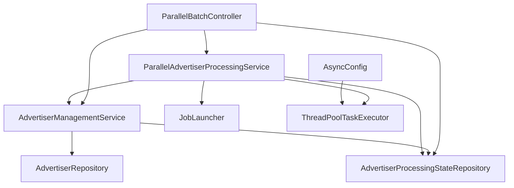
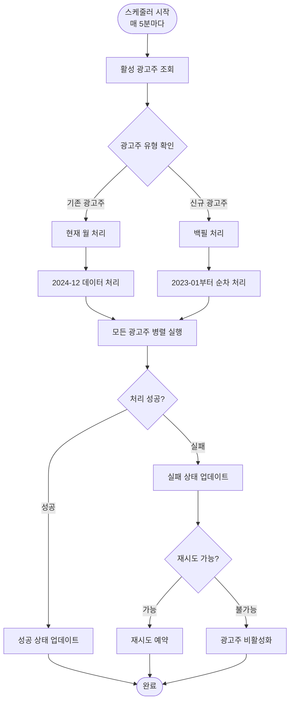
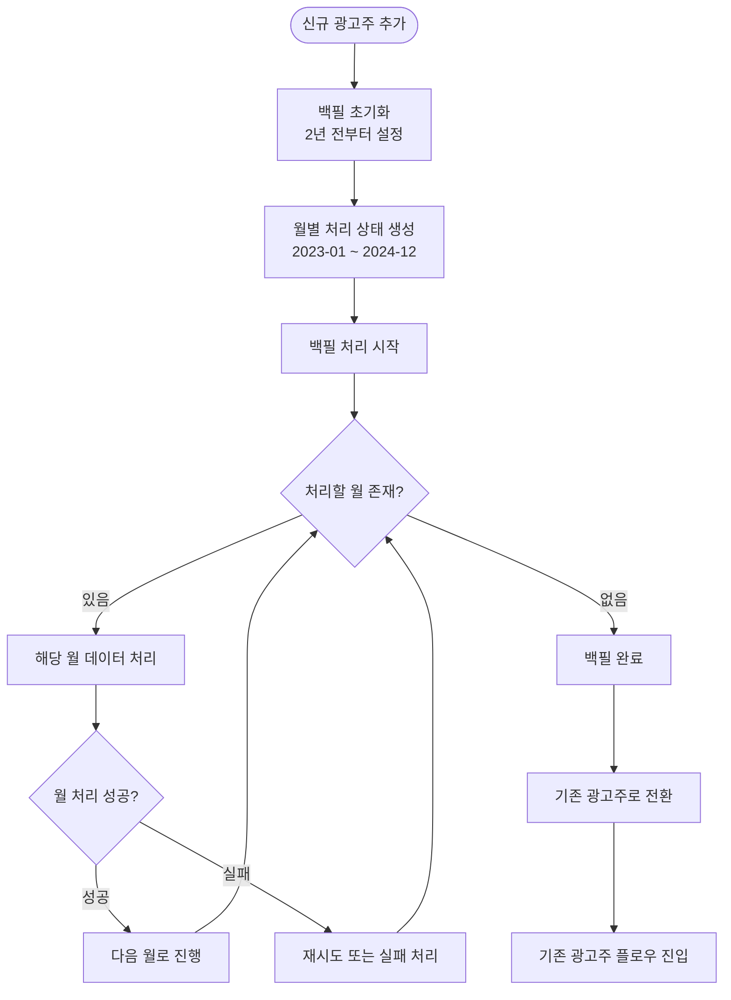

# CDP 병렬 배치 처리 시스템

## 🚀 개요 (Overview)

이 시스템은 CDP(Customer Data Platform) 배치 처리를 모든 광고주에 대해 **병렬로 동시 실행**하며, 광고주 유형에 따라 다른 처리 로직을 적용합니다.

### 🔄 기존 시스템 vs 새로운 시스템

| 구분 | 기존 시스템 | 새로운 병렬 시스템 |
|------|-------------|-------------------|
| **실행 방식** | 순환 처리 (Round-Robin) | 병렬 동시 실행 |
| **처리 속도** | 광고주 수만큼 시간 소요 | 모든 광고주 동시 처리 |
| **신규 광고주** | 현재 월만 처리 | 2년 백필 자동 처리 |
| **상태 관리** | 기본적인 성공/실패만 추적 | 월별 상세 상태 추적 |
| **장애 격리** | 한 광고주 실패 시 전체 영향 | 광고주별 독립적 처리 |

## 🏗️ 아키텍처 (Architecture)

### 주요 컴포넌트



### 핵심 엔티티

1. **Advertiser** - 광고주 정보 및 처리 상태
2. **AdvertiserProcessingState** - 월별 상세 처리 상태
3. **ParallelAdvertiserProcessingService** - 병렬 처리 오케스트레이터
4. **AdvertiserManagementService** - 광고주 생성 및 관리

## 📊 운영 플로우 (Operational Flow)

### 1. 전체 시스템 플로우



### 2. 신규 광고주 백필 플로우



### 3. 병렬 처리 예시

**시나리오**: 3개 광고주 (A: 기존, B: 기존, C: 신규)

```
시간 T=0:
┌─────────────┬─────────────┬─────────────┐
│ 광고주 A    │ 광고주 B    │ 광고주 C    │
│ (기존)      │ (기존)      │ (신규)      │
├─────────────┼─────────────┼─────────────┤
│ 2024-12     │ 2024-12     │ 2023-01     │
│ 데이터 처리 │ 데이터 처리 │ 백필 시작   │
└─────────────┴─────────────┴─────────────┘

모든 작업이 동시에 병렬 실행됨
```

## 🔧 설정 및 구성 (Configuration)

### 스레드 풀 설정

```java
// AsyncConfig.java
@Bean(name = "batchTaskExecutor")
public Executor batchTaskExecutor() {
    ThreadPoolTaskExecutor executor = new ThreadPoolTaskExecutor();
    executor.setCorePoolSize(5);      // 기본 스레드 수
    executor.setMaxPoolSize(20);      // 최대 스레드 수
    executor.setQueueCapacity(100);   // 대기 큐 크기
    return executor;
}
```

### 스케줄링 설정

```java
// ParallelAdvertiserProcessingService.java
@Scheduled(fixedDelay = 300000) // 5분마다 실행
public void orchestrateParallelBatchJobs() {
    // 병렬 배치 작업 실행
}
```

## 📊 모니터링 및 관리 (Monitoring & Management)

### REST API 엔드포인트

| HTTP Method | 엔드포인트 | 설명 |
|-------------|------------|------|
| `GET` | `/api/v2/batch/status` | 시스템 전체 상태 조회 |
| `GET` | `/api/v2/batch/advertisers/{id}/backfill-progress` | 백필 진행 상황 |
| `GET` | `/api/v2/batch/advertisers/{id}/processing-states` | 월별 처리 상태 |
| `GET` | `/api/v2/batch/running-jobs` | 실행 중인 작업 목록 |
| `POST` | `/api/v2/batch/advertisers/{id}/trigger` | 수동 배치 트리거 |
| `POST` | `/api/v2/batch/advertisers/{id}/retry/{month}` | 실패 월 재시도 |
| `POST` | `/api/v2/batch/advertisers/{id}/activate` | 광고주 활성화 |
| `POST` | `/api/v2/batch/advertisers/{id}/deactivate` | 광고주 비활성화 |
| `GET` | `/api/v2/batch/health` | 헬스체크 |

### 상태 조회 예시

```bash
# 시스템 전체 상태
curl http://localhost:8080/api/v2/batch/status

# 특정 광고주 백필 진행률
curl http://localhost:8080/api/v2/batch/advertisers/ADV001/backfill-progress

# 실행 중인 작업들
curl http://localhost:8080/api/v2/batch/running-jobs
```

## 🗄️ 데이터베이스 스키마 (Database Schema)

### Advertiser 테이블 확장

```sql
-- 기존 필드들 +
ALTER TABLE advertisers ADD COLUMN advertiser_type VARCHAR(20) DEFAULT 'EXISTING';
ALTER TABLE advertisers ADD COLUMN current_processing_month VARCHAR(7);
ALTER TABLE advertisers ADD COLUMN backfill_start_month VARCHAR(7);
ALTER TABLE advertisers ADD COLUMN backfill_completed BOOLEAN DEFAULT false;
ALTER TABLE advertisers ADD COLUMN last_completed_month VARCHAR(7);
```

### 새로운 AdvertiserProcessingState 테이블

```sql
CREATE TABLE advertiser_processing_states (
    id BIGINT AUTO_INCREMENT PRIMARY KEY,
    advertiser_id VARCHAR(50) NOT NULL,
    processing_month VARCHAR(7) NOT NULL,
    status VARCHAR(20) NOT NULL DEFAULT 'PENDING',
    started_at TIMESTAMP,
    completed_at TIMESTAMP,
    processed_records BIGINT DEFAULT 0,
    failed_records BIGINT DEFAULT 0,
    error_message VARCHAR(1000),
    retry_count INT DEFAULT 0,
    max_retries INT DEFAULT 3,
    created_at TIMESTAMP DEFAULT CURRENT_TIMESTAMP,
    updated_at TIMESTAMP DEFAULT CURRENT_TIMESTAMP ON UPDATE CURRENT_TIMESTAMP,
    
    UNIQUE KEY uk_advertiser_month (advertiser_id, processing_month),
    INDEX idx_status (status),
    INDEX idx_advertiser_id (advertiser_id)
);
```

## 🚨 장애 대응 및 복구 (Error Handling & Recovery)

### 1. 스테일 작업 정리

```java
@Scheduled(fixedDelay = 600000) // 10분마다
public void cleanupStaleJobs() {
    // 30분 이상 실행 중인 작업들을 실패로 처리
}
```

### 2. 재시도 메커니즘

- 각 월별로 최대 3회 재시도
- 지수 백오프 적용 (1분 → 2분 → 4분)
- 수동 재시도 API 제공

### 3. 장애 격리

- 광고주별 독립적 처리
- 한 광고주 실패가 다른 광고주에 영향 없음
- 실패한 광고주 자동 비활성화

## 📈 성능 최적화 (Performance Optimization)

### 배치 크기 조정

```java
// 광고주별 처리 레코드 제한
.limit(1000) // 광고주당 최대 1000개 레코드
```

### 메모리 관리

- 스트림 처리로 메모리 효율성 확보
- 청크 단위 처리 (50개씩)
- 가비지 컬렉션 최적화

### 데이터베이스 최적화

- 인덱스 최적화 (advertiser_id, processing_month)
- 배치 삽입/업데이트
- 커넥션 풀 조정

## 🔄 마이그레이션 가이드 (Migration Guide)

### 1. 기존 시스템에서 새 시스템으로 전환

```bash
# 1. 기존 스케줄러 비활성화
# AdvertiserRotationService, BatchJobOrchestrator 주석 처리

# 2. 새 테이블 생성
# advertiser_processing_states 테이블 생성

# 3. 기존 광고주 데이터 마이그레이션
# advertiser_type을 EXISTING으로 설정

# 4. 새 스케줄러 활성화
# ParallelAdvertiserProcessingService 활성화
```

### 2. 신규 광고주 추가 시

```java
// 기존 방식
Advertiser advertiser = new Advertiser();
advertiser.setAdvertiserId("NEW_ADV");
advertiser.setName("신규 광고주");
advertiserRepository.save(advertiser);

// 새 방식 (자동 백필 설정)
Advertiser advertiser = new Advertiser();
advertiser.setAdvertiserId("NEW_ADV");
advertiser.setName("신규 광고주");
AdvertiserManagementService.createNewAdvertiser(advertiser);
```

## 🔍 트러블슈팅 (Troubleshooting)

### 자주 발생하는 문제들

1. **백필 처리가 진행되지 않는 경우**
   ```bash
   # 광고주 상태 확인
   curl http://localhost:8080/api/v2/batch/advertisers/ADV001/backfill-progress
   
   # 처리 상태 상세 조회
   curl http://localhost:8080/api/v2/batch/advertisers/ADV001/processing-states
   ```

2. **스레드 풀 부족**
   ```properties
   # application.properties에서 조정
   batch.thread-pool.core-size=10
   batch.thread-pool.max-size=50
   ```

3. **메모리 부족**
   - 배치 크기 축소
   - 힙 메모리 증가 (-Xmx4g)

### 로그 모니터링

```bash
# 병렬 처리 로그 확인
grep "병렬 배치 작업" application.log

# 백필 진행 상황 로그
grep "백필 처리" application.log

# 에러 로그 확인
grep "ERROR" application.log | grep "광고주"
```

## 📋 운영 체크리스트 (Operations Checklist)

### 일일 점검사항

- [ ] 시스템 헬스체크 확인
- [ ] 실행 중인 작업 수 모니터링
- [ ] 실패한 작업 확인 및 재시도
- [ ] 스레드 풀 사용률 확인
- [ ] 메모리 사용량 확인

### 주간 점검사항

- [ ] 신규 광고주 백필 진행률 확인
- [ ] 성능 메트릭 분석
- [ ] 에러 로그 분석
- [ ] 데이터베이스 성능 확인

### 월간 점검사항

- [ ] 전체 시스템 성능 리뷰
- [ ] 스레드 풀 크기 최적화
- [ ] 배치 크기 최적화
- [ ] 데이터 아카이빙 검토

---

## 💡 주요 개선사항 요약

1. **병렬 처리**: 모든 광고주 동시 실행으로 처리 시간 단축
2. **백필 자동화**: 신규 광고주의 2년 히스토리 데이터 자동 처리
3. **상태 추적**: 월별 상세 진행 상황 모니터링
4. **장애 격리**: 광고주별 독립적 처리로 안정성 향상
5. **운영 편의성**: REST API를 통한 모니터링 및 관리 기능

이 시스템으로 인해 CDP 배치 처리의 효율성과 안정성이 크게 향상되었습니다. 🚀